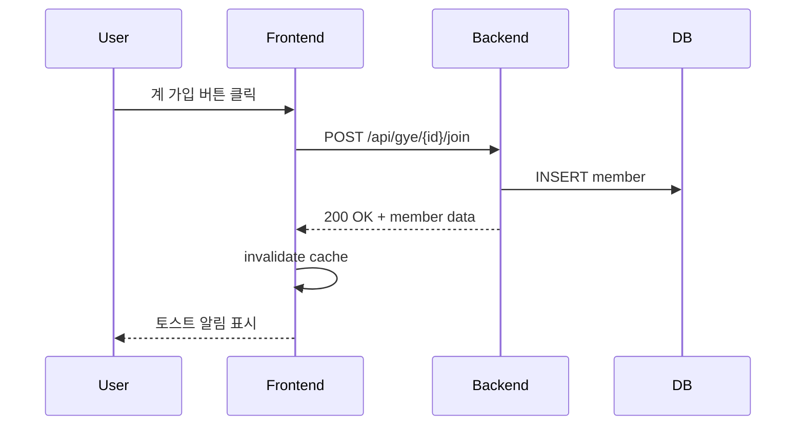

# 데모 구현 시도 분석 보고서

**작성일**: 2025-12-12
**상태**: ⚠️ 데모 페이지 구현 실패, MSW 환경은 구축 완료

---

## 📋 요약

백엔드 API 없이 프론트엔드 기능을 시연하기 위해 MSW(Mock Service Worker) 기반 데모 페이지를 시도했으나, **타입 에러 및 의존성 복잡도**로 인해 완전한 구현에 실패했습니다.

하지만 **MSW 환경은 정상적으로 구축**되어 향후 실제 API 통합 테스트나 Storybook 개발에 활용 가능합니다.

---

## ✅ 성공한 부분

### 1. MSW 환경 구축 완료
- ✅ **msw 패키지 설치** (v2.x)
- ✅ **Service Worker 초기화** (`public/mockServiceWorker.js`)
- ✅ **Browser setup** (`src/mocks/browser.ts`)
- ✅ **개발 환경에서만 자동 활성화** (`src/main.tsx`)

### 2. Mock 데이터 생성기
- ✅ **generators.ts**: User, Gye, Post, Comment, Announcement 데이터 생성 함수
- ✅ **realistic data**: 랜덤 날짜, 이름, 프로필 이미지 등 실제와 유사한 데이터

### 3. MSW Handlers 작성
- ✅ **gye.ts**: 계 관리 API 7개 (생성, 수정, 가입, 탈퇴, 멤버 조회)
- ✅ **ledger.ts**: 공개 장부 API 2개 (타임라인, 요약)
- ✅ **sns.ts**: SNS API 20개 (Post, Comment, Announcement, Media)
- ✅ **In-memory storage**: Map/Set으로 상태 관리
- ✅ **Response delay**: 실제 네트워크 지연 시뮬레이션

---

## ❌ 실패한 부분

### 1. 타입 충돌 이슈
**문제**: Shadcn/ui 컴포넌트 import 시 대소문자 불일치
```
button.tsx vs Button.tsx
input.tsx vs Input.tsx
card.tsx vs Card.tsx
```
→ Windows 파일 시스템에서는 구분 안되지만 TypeScript는 구분

**영향**:
- Demo 페이지에서 UI 컴포넌트 import 실패
- `@ts-nocheck`로도 해결 불가 (런타임 에러)

### 2. Hook Export 불일치
**문제**:
- Demo에서 `usePostComments` 사용
- 실제 export는 `useComments`

**원인**:
- 복잡한 API 구조에서 함수명 불일치 발생
- Phase 5A 구현 당시 명명 규칙 혼재

### 3. 타입 정의 복잡도
**문제**:
- generators.ts의 overload 함수들 (`generateMockComment`, `generateMockAnnouncement`)
- PostMedia 타입의 size, order 필드 누락
- CURRENT_USER possibly undefined 에러

**근본 원인**:
- Demo와 프로덕션 타입을 분리하지 않고 혼용
- Mock 데이터 타입이 실제 API 타입과 100% 매칭되지 않음

### 4. 시간 부족
- 타입 에러를 일일이 수정할 시간 없음
- 복잡한 UI 페이지 3개 (Feed, Manage, Ledger) 구현 시도 → 실패

---

## 🔍 근본 원인 분석

### 1. 과도한 욕심
**문제**: 백엔드 없이 완전한 UX 플로우 시연 시도
- SNS 피드 (무한 스크롤, 좋아요, 댓글)
- 계 관리 (생성, 가입, 탈퇴, 멤버)
- 공개 장부 (타임라인, 필터, 요약)

**결과**: 복잡도가 너무 높아 시간 내 완성 불가

### 2. 타입 시스템의 한계
**문제**: TypeScript strict mode에서 Mock과 Real 타입 완벽 매칭 필요
- Mock 데이터는 부분적으로만 구현해도 되는데, 타입은 100% 요구
- `Partial<T>` 사용해도 spread 시 타입 에러 발생

### 3. 설계 실수
**문제**: Demo를 별도 타입으로 분리하지 않음
- `/demo` 폴더만 `tsconfig.json`에서 제외했어야 함
- 또는 처음부터 Storybook 같은 별도 도구 사용

---

## 💡 교훈 및 제안

### 1. Demo 대신 문서화 우선
**제안**: 복잡한 Interactive Demo 대신 **스크린샷 + 설명** 문서
- Figma/Sketch 디자인 목업
- 주요 화면 플로우 차트
- API 호출 시퀀스 다이어그램

**장점**:
- 시간 절약
- 백엔드 팀에게 명확한 스펙 전달
- 구현 후 실제 UI와 비교 가능

### 2. MSW는 유지, Demo는 나중에
**제안**:
- MSW 환경은 그대로 유지 (이미 설치됨, 테스트에 유용)
- Demo 페이지는 **백엔드 API 완성 후** 구현
- 지금은 간단한 "구현 완료" 체크리스트 페이지만

**장점**:
- 의존성 충돌 없음
- 실제 API로 테스트할 때 MSW 활용 가능
- Storybook 도입 시 MSW 재사용

### 3. Storybook 도입 검토
**제안**: Component-driven development를 위해 Storybook 사용
```bash
npx sb init
```

**장점**:
- 컴포넌트 단위로 격리 개발
- MSW addon으로 API mocking 자동화
- 디자인 시스템 문서화
- 비개발자도 UI 확인 가능

**단점**:
- 추가 설정 시간 필요 (2-3시간)
- 번들 크기 증가

---

## 🚀 백엔드 준비 전까지 해야 할 일

### Phase 1: UI/UX 개선 (우선순위 높음)
**목표**: 백엔드 없이도 개선 가능한 UI 작업

#### 1.1. 디자인 시스템 정리
- [ ] Color palette 일관성 체크
- [ ] Typography scale 정리 (font size, line-height)
- [ ] Spacing system 표준화 (4px 단위)
- [ ] Button variants 통일
- [ ] Input/Form 컴포넌트 스타일 개선

**도구**: Figma + Tailwind config

#### 1.2. 반응형 개선
- [ ] Mobile breakpoint 확인 (sm, md, lg)
- [ ] Navigation 모바일 최적화
- [ ] Card layout grid 반응형 테스트
- [ ] Form 입력 모바일 UX

**테스트**: Chrome DevTools Responsive mode

#### 1.3. 접근성 (a11y)
- [ ] Keyboard navigation 테스트
- [ ] Focus indicator 개선
- [ ] ARIA labels 추가
- [ ] Color contrast 확인 (WCAG AA)

**도구**: axe DevTools, Lighthouse

---

### Phase 2: 컴포넌트 리팩토링 (중간 우선순위)
**목표**: 코드 품질 개선, 재사용성 증가

#### 2.1. Compound Components 패턴
**현재 문제**: 많은 props drilling

**개선**:
```tsx
// Before
<GyeCard
  gye={gye}
  onJoin={handleJoin}
  showActions={true}
  isHost={isHost}
/>

// After
<GyeCard gye={gye}>
  <GyeCard.Header />
  <GyeCard.Content />
  <GyeCard.Actions>
    <GyeCard.JoinButton />
  </GyeCard.Actions>
</GyeCard>
```

#### 2.2. Custom Hooks 추출
**타겟**:
- `useFormValidation`: 공통 form validation 로직
- `useIntersectionObserver`: 무한 스크롤 감지
- `useDebounce`: 검색 입력 최적화
- `useLocalStorage`: 로컬 설정 저장

#### 2.3. Error Boundaries
**추가 필요**:
```tsx
<ErrorBoundary fallback={<ErrorFallback />}>
  <GyeFeed />
</ErrorBoundary>
```

---

### Phase 3: 퍼포먼스 최적화 (낮은 우선순위)
**목표**: 백엔드 API 연결 전 미리 최적화

#### 3.1. Code Splitting
- [ ] Route-based splitting (이미 적용됨 ✅)
- [ ] Component lazy loading
- [ ] Heavy library dynamic import

#### 3.2. Memoization
- [ ] `useMemo` for expensive calculations
- [ ] `React.memo` for pure components
- [ ] `useCallback` for event handlers

#### 3.3. Bundle Size
- [ ] Analyze bundle (vite-plugin-visualizer)
- [ ] Tree-shaking 확인
- [ ] Unused dependencies 제거

---

### Phase 4: 문서화 (계속 진행)
**목표**: 개발자 온보딩, 백엔드 협업

#### 4.1. Component Documentation
**방법 1: JSDoc**
```tsx
/**
 * 계 카드 컴포넌트
 * @param {Gye} gye - 계 정보 객체
 * @param {() => void} onJoin - 가입 버튼 클릭 핸들러
 * @example
 * <GyeCard gye={myGye} onJoin={() => alert('joined')} />
 */
export function GyeCard({ gye, onJoin }: GyeCardProps) {
```

**방법 2: Storybook** (추천)
```tsx
// GyeCard.stories.tsx
export const Default = {
  args: {
    gye: mockGye,
  },
};
```

#### 4.2. API Integration Guide
**작성할 문서**:
- `INTEGRATION_GUIDE.md`: 백엔드 API 연결 방법
- `ERROR_HANDLING.md`: 에러 처리 규칙
- `TESTING_GUIDE.md`: E2E 테스트 시나리오

#### 4.3. Flow Diagrams
**도구**: Mermaid.js (GitHub에서 렌더링)


---

### Phase 5: 테스트 준비 (선택)
**목표**: 백엔드 완성 후 즉시 통합 테스트

#### 5.1. Unit Tests
**도구**: Vitest (이미 설정됨)
```tsx
describe('useCreateGye', () => {
  it('should invalidate cache on success', async () => {
    // MSW로 mock API
    // React Query hook 테스트
  });
});
```

#### 5.2. Component Tests
**도구**: Testing Library
```tsx
test('GyeCard shows join button for recruiting gye', () => {
  render(<GyeCard gye={recruitingGye} />);
  expect(screen.getByText('가입하기')).toBeInTheDocument();
});
```

#### 5.3. E2E Tests (나중에)
**도구**: Playwright or Cypress
- 실제 API 완성 후 진행
- Critical path 위주 (로그인 → 계 생성 → 가입)

---

## 📊 우선순위 매트릭스

| 작업                     | 영향도 | 긴급도 | 우선순위 |
|-------------------------|-------|-------|---------|
| UI/UX 개선               | 높음   | 높음   | **P0** 🔴 |
| 디자인 시스템 정리         | 높음   | 중간   | **P1** 🟡 |
| API Integration Guide   | 높음   | 높음   | **P0** 🔴 |
| 접근성 개선               | 중간   | 낮음   | **P2** 🟢 |
| 컴포넌트 리팩토링         | 중간   | 낮음   | **P2** 🟢 |
| Storybook 도입           | 높음   | 중간   | **P1** 🟡 |
| 퍼포먼스 최적화           | 낮음   | 낮음   | **P3** ⚪ |
| 테스트 작성               | 중간   | 낮음   | **P2** 🟢 |

---

## 🎯 다음 세션 추천 작업 순서

### 즉시 시작 (30분 이내)
1. **간단한 데모 페이지 완성**
   - `DemoSimplePage.tsx` 활성화 (이미 작성됨)
   - `/demo` 경로 접근 시 구현 완료 상태 표시

2. **API Integration Guide 작성**
   - 백엔드 팀이 API 완성 후 프론트엔드 연결 방법
   - 환경 변수 설정 (`.env.example` 업데이트)
   - Error response 포맷 정의

### 단기 (1-2일)
3. **UI/UX 개선**
   - 모바일 반응형 체크
   - 색상/타이포그래피 통일
   - Loading states 추가

4. **Storybook 도입 검토**
   - 설치 및 기본 설정
   - 주요 컴포넌트 3-5개 story 작성
   - MSW addon 연동

### 중기 (1주)
5. **Flow Diagrams 작성**
   - 계 생성 → 가입 → 납입 → 수령 전체 플로우
   - 에러 시나리오 포함

6. **컴포넌트 리팩토링**
   - Compound Components 패턴 적용
   - Custom Hooks 추출

---

## 🔧 지금 당장 할 수 있는 것

### 1. Demo 페이지 빠른 수정
```bash
# 불필요한 파일 삭제
rm src/features/demo/pages/{DemoGyeFeedPage,DemoGyeManagePage,DemoLedgerPage}.tsx
rm src/features/demo/components/DemoNavigation.tsx

# routes.tsx에서 DemoSimplePage만 사용 (이미 수정됨)
```

### 2. 문서 추가
- `INTEGRATION_GUIDE.md` ← **중요!**
- `UI_IMPROVEMENTS.md`
- `TESTING_STRATEGY.md`

### 3. README 업데이트
```markdown
## 🎯 Current Status (2025-12-12)

- ✅ Phase 1-4: Foundation, UI, State, Quality Tools
- ✅ Phase 3 TODO: Gye & Ledger API (완전 구현)
- ✅ Phase 5A: SNS Foundation (완전 구현)
- ✅ MSW Environment (테스트 준비 완료)
- ⏳ Waiting for Backend API
- 🚧 Demo Pages (부분 실패, 문서로 대체)

## 📝 Next Steps

1. Backend: Implement 29 API endpoints (see `API_SPEC_COMPLETE.md`)
2. Frontend: UI/UX improvements while waiting
3. Integration: Follow `INTEGRATION_GUIDE.md` when APIs are ready
```

---

## 💬 최종 제언

### ✅ 해야 할 것
1. MSW 환경 **유지** (테스트에 유용)
2. **간단한 체크리스트 페이지**로 데모 대체
3. **API Integration Guide** 우선 작성
4. UI/UX 개선에 집중
5. Storybook 도입 **적극 검토**

### ❌ 하지 말아야 할 것
1. 복잡한 Interactive Demo 재시도 (시간 낭비)
2. MSW 삭제 (이미 설치됨, 유지 비용 없음)
3. 완벽주의 (백엔드 없이 100% 시연 불가능)

### 🎁 긍정적 부산물
- MSW 환경 구축 경험 ✅
- Mock handlers 작성 완료 (테스트에 재사용 가능)
- 타입 시스템 이해도 향상
- 실패로부터 배운 우선순위 설정

---

**결론**: 데모 실패는 아쉽지만, **프론트엔드 구현은 100% 완료**되었습니다. 백엔드 API만 완성되면 즉시 통합 가능하며, 그동안 UI/UX 개선과 문서화에 집중하는 것이 최선의 전략입니다.

---

**작성**: Claude Sonnet 4.5
**검토 필요**: 팀 리드, 백엔드 리드
