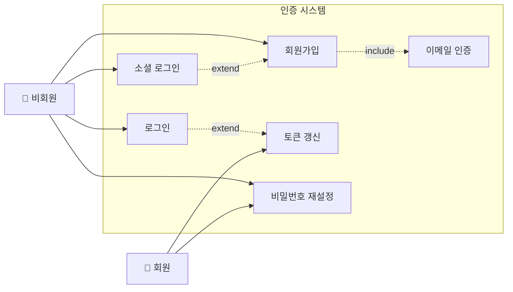
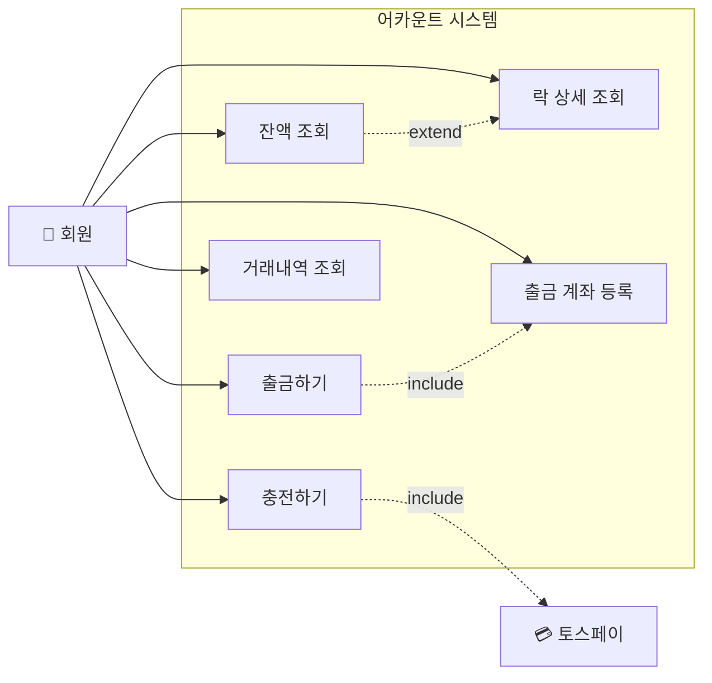
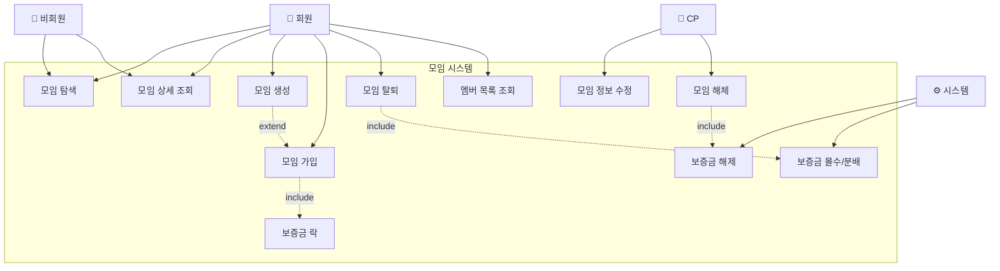
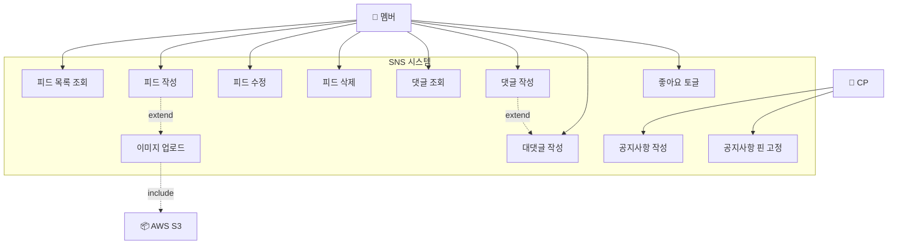
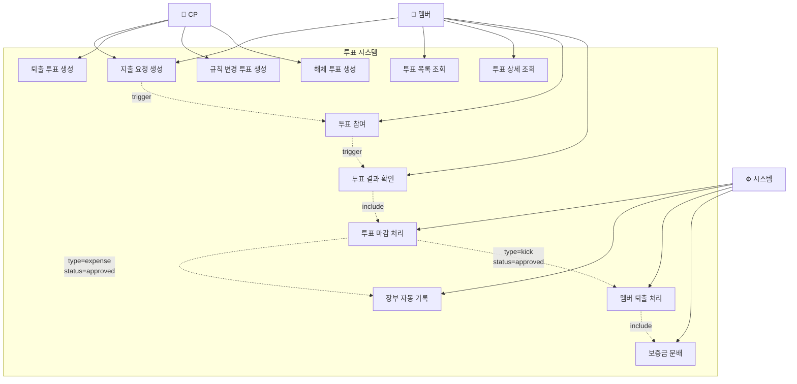
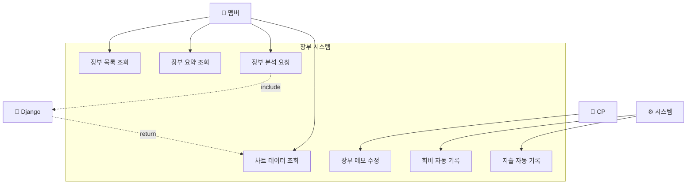
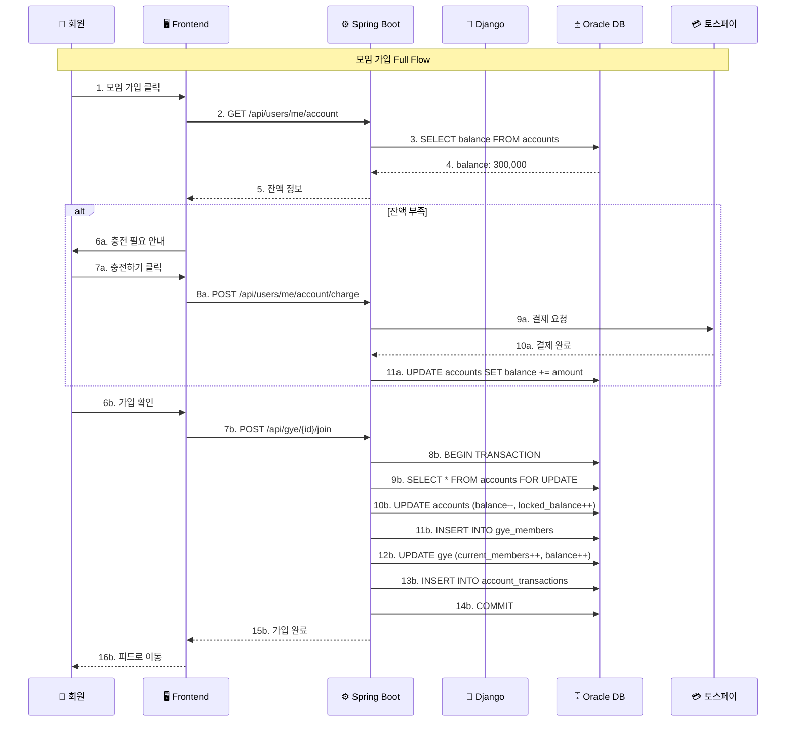

# WOORIDO 유스케이스 다이어그램

**작성일**: 2026-01-05
**버전**: v1.0
**기반**: WOORIDO_FINAL_SPECIFICATION.md, ERD v2.1

---

## 1. 전체 시스템 유스케이스 (Overview)

```mermaid
graph TB
    subgraph Actors
        Guest[🧑 비회원]
        Member[👤 회원/멤버]
        CP[👑 CP/모임장]
        System[⚙️ 시스템]
    end

    subgraph "WOORIDO Platform"
        subgraph "인증 시스템"
            UC1[회원가입]
            UC2[로그인]
            UC3[소셜 로그인]
        end

        subgraph "어카운트 시스템"
            UC4[잔액 조회]
            UC5[충전하기]
            UC6[출금하기]
            UC7[거래내역 조회]
        end

        subgraph "모임 시스템"
            UC8[모임 탐색]
            UC9[모임 생성]
            UC10[모임 가입]
            UC11[모임 탈퇴]
            UC12[모임 정보 수정]
            UC13[모임 해체]
        end

        subgraph "SNS 시스템"
            UC14[피드 조회]
            UC15[피드 작성]
            UC16[댓글 작성]
            UC17[좋아요]
            UC18[공지사항 관리]
        end

        subgraph "투표 시스템"
            UC19[지출 요청]
            UC20[퇴출 투표 생성]
            UC21[투표 참여]
            UC22[투표 결과 확인]
        end

        subgraph "장부 시스템"
            UC23[장부 조회]
            UC24[장부 분석]
            UC25[장부 메모 수정]
        end
    end

    %% 비회원
    Guest --> UC1
    Guest --> UC2
    Guest --> UC3
    Guest --> UC8

    %% 회원/멤버
    Member --> UC4
    Member --> UC5
    Member --> UC6
    Member --> UC7
    Member --> UC8
    Member --> UC9
    Member --> UC10
    Member --> UC11
    Member --> UC14
    Member --> UC15
    Member --> UC16
    Member --> UC17
    Member --> UC19
    Member --> UC21
    Member --> UC22
    Member --> UC23
    Member --> UC24

    %% CP
    CP --> UC12
    CP --> UC13
    CP --> UC18
    CP --> UC19
    CP --> UC20
    CP --> UC25

    %% 시스템
    System --> UC22
```



---

## 2. 상세 유스케이스 다이어그램

### 2.1 인증 시스템



**유스케이스 명세**:

| UC ID | 유스케이스명 | 액터 | 설명 | 선행조건 | 후행조건 |
|-------|-------------|------|------|----------|----------|
| UC-A01 | 회원가입 | 비회원 | 이메일/비밀번호로 계정 생성 | 없음 | 이메일 인증 필요 |
| UC-A02 | 로그인 | 비회원 | 이메일/비밀번호로 인증 | 회원가입 완료 | JWT 토큰 발급 |
| UC-A03 | 소셜 로그인 | 비회원 | 카카오/구글 OAuth | 없음 | 자동 회원가입 또는 로그인 |
| UC-A04 | 토큰 갱신 | 회원 | Access Token 재발급 | Refresh Token 유효 | 새 Access Token |
| UC-A05 | 비밀번호 재설정 | 비회원/회원 | 이메일로 재설정 링크 발송 | 이메일 등록됨 | 새 비밀번호 설정 |

---

### 2.2 어카운트 시스템



**유스케이스 명세**:

| UC ID | 유스케이스명 | 액터 | 설명 | 비즈니스 규칙 |
|-------|-------------|------|------|--------------|
| UC-B01 | 잔액 조회 | 회원 | 가용/락 잔액 확인 | - |
| UC-B02 | 충전하기 | 회원 | 토스페이로 가용잔액 충전 | 최소 1만원, 최대 100만원 |
| UC-B03 | 출금하기 | 회원 | 가용잔액을 은행계좌로 출금 | 락 잔액 제외 |
| UC-B04 | 거래내역 조회 | 회원 | 충전/출금/락 이력 확인 | 페이지네이션 20개 |
| UC-B05 | 락 상세 조회 | 회원 | 모임별 보증금 현황 | - |

---

### 2.3 모임 시스템



**유스케이스 명세**:

| UC ID | 유스케이스명 | 액터 | 설명 | 비즈니스 규칙 |
|-------|-------------|------|------|--------------|
| UC-C01 | 모임 탐색 | 비회원/회원 | 카테고리/키워드로 모임 검색 | 공개 모임만 |
| UC-C02 | 모임 상세 조회 | 비회원/회원 | 모임 정보, 회비, 인원 확인 | - |
| UC-C03 | 모임 생성 | 회원 | 새 모임 개설 | 생성자가 CP됨 |
| UC-C04 | 모임 가입 | 회원 | 모임에 참여 | **2개월치 필요 (납입+보증금)** |
| UC-C05 | 모임 탈퇴 | 회원 | 모임에서 나가기 | **보증금 몰수** |
| UC-C06 | 모임 정보 수정 | CP | 이름, 설명, 규칙 변경 | 모집 중에만 회비 변경 가능 |
| UC-C07 | 모임 해체 | CP | 모임 종료 | **전원 보증금 반환** |
| UC-C09 | 보증금 락 | 시스템 | 가입 시 보증금 잠금 | `ACCOUNTS.locked_balance += deposit` |
| UC-C10 | 보증금 해제 | 시스템 | 완주/해체 시 반환 | `locked_balance → balance` |
| UC-C11 | 보증금 몰수/분배 | 시스템 | 이탈 시 남은 멤버에게 분배 | 균등 분배 |

---

### 2.4 SNS 시스템



**유스케이스 명세**:

| UC ID | 유스케이스명 | 액터 | 설명 | 비즈니스 규칙 |
|-------|-------------|------|------|--------------|
| UC-D01 | 피드 목록 조회 | 멤버 | 모임 피드 페이지네이션 | 20개씩, 최신순 |
| UC-D02 | 피드 작성 | 멤버 | 텍스트 + 이미지 게시 | 최대 2,000자, 10장 |
| UC-D06 | 댓글 작성 | 멤버 | 피드에 댓글 | - |
| UC-D07 | 대댓글 작성 | 멤버 | 댓글에 답글 | **2단계까지만** |
| UC-D08 | 좋아요 토글 | 멤버 | 피드/댓글 좋아요 | Optimistic UI |
| UC-D09 | 공지사항 작성 | CP | 공지글 작성 | 피드 상단 핀 |

---

### 2.5 투표 시스템 ⭐



**투표 유형별 유스케이스**:

| UC ID | 유스케이스명 | 액터 | type | 필요 찬성률 | 기간 | 승인 시 액션 |
|-------|-------------|------|------|------------|------|-------------|
| UC-E01 | 지출 요청 (일반) | 멤버/CP | `expense` | 50% | 72시간 | 장부 기록 + 잔액 차감 |
| UC-E01 | 지출 요청 (대형) | 멤버/CP | `expense` | 67% | 72시간 | 장부 기록 + 잔액 차감 |
| UC-E02 | 퇴출 투표 | CP | `kick` | 70% | 72시간 | 멤버 탈퇴 + 보증금 몰수 |
| UC-E03 | 규칙 변경 | CP | `rule_change` | 80% | 7일 | 모임 설정 변경 |
| UC-E04 | 해체 투표 | CP | `dissolve` | 100% | 7일 | 모임 해체 + 보증금 반환 |

**투표 상태 전이**:

```
┌─────────────────────────────────────────────────────────────┐
│                    투표 상태 머신                            │
├─────────────────────────────────────────────────────────────┤
│                                                             │
│                      ┌─────────┐                           │
│                      │  OPEN   │                           │
│                      └────┬────┘                           │
│                           │                                │
│            ┌──────────────┼──────────────┐                 │
│            │              │              │                 │
│            ▼              ▼              ▼                 │
│     ┌──────────┐   ┌──────────┐   ┌──────────┐            │
│     │ APPROVED │   │ REJECTED │   │ EXPIRED  │            │
│     └────┬─────┘   └──────────┘   └──────────┘            │
│          │                                                 │
│          │ type=expense                                    │
│          ▼                                                 │
│   ┌────────────────┐                                       │
│   │ LEDGER_ENTRIES │                                       │
│   │    생성        │                                       │
│   └────────────────┘                                       │
│                                                             │
└─────────────────────────────────────────────────────────────┘
```

---

### 2.6 장부 시스템



**유스케이스 명세**:

| UC ID | 유스케이스명 | 액터 | 설명 | 연동 시스템 |
|-------|-------------|------|------|------------|
| UC-F01 | 장부 목록 조회 | 멤버 | 타임라인 형식 거래내역 | - |
| UC-F02 | 장부 요약 조회 | 멤버 | 총수입/총지출/잔액 | - |
| UC-F03 | 장부 분석 요청 | 멤버 | 월별/카테고리별 통계 | **Django** |
| UC-F04 | 차트 데이터 조회 | 멤버 | Recharts용 JSON | Django → Spring |
| UC-F05 | 장부 메모 수정 | CP | 카테고리/메모 변경 | 감사 로그 기록 |
| UC-F06 | 회비 자동 기록 | 시스템 | 납입 시 장부 기록 | `type=FEE_COLLECTION` |
| UC-F07 | 지출 자동 기록 | 시스템 | 투표 승인 시 기록 | `type=EXPENSE` |

---

## 3. 시스템 간 상호작용 (Sequence Context)



---

## 4. 유스케이스 우선순위 (Demo Day)

### P0 (필수)

| 도메인 | 유스케이스 | Phase |
|--------|-----------|-------|
| 인증 | 로그인, 회원가입 | 1 |
| 어카운트 | 잔액조회, 충전 | 3 |
| 모임 | 가입, 탈퇴, 보증금 락 | 3 |
| SNS | 피드 CRUD, 댓글, 좋아요 | 2 |
| 투표 | 지출 요청, 투표 참여, 결과 | 5 |
| 장부 | 조회, 요약, 차트 | 4 |

### P1 (권장)

| 도메인 | 유스케이스 | Phase |
|--------|-----------|-------|
| 인증 | 소셜 로그인 | Post-Demo |
| 어카운트 | 출금 | Post-Demo |
| SNS | 이미지 업로드 | 2-3 |
| 장부 | Django 분석 | 4 |

### P2 (Post-Demo)

| 도메인 | 유스케이스 |
|--------|-----------|
| 투표 | 퇴출, 규칙변경, 해체 |
| 모임 | Elasticsearch 검색 |
| 알림 | 실시간 푸시 |

---

## 5. 액터-유스케이스 매트릭스

| 유스케이스 | 비회원 | 회원 | 멤버 | CP | 시스템 |
|-----------|:------:|:----:|:----:|:--:|:------:|
| 회원가입 | ✅ | - | - | - | - |
| 로그인 | ✅ | - | - | - | - |
| 잔액 조회 | - | ✅ | ✅ | ✅ | - |
| 충전 | - | ✅ | ✅ | ✅ | - |
| 모임 탐색 | ✅ | ✅ | ✅ | ✅ | - |
| 모임 생성 | - | ✅ | - | - | - |
| 모임 가입 | - | ✅ | - | - | - |
| 모임 탈퇴 | - | - | ✅ | ✅ | - |
| 모임 수정 | - | - | - | ✅ | - |
| 피드 조회 | - | - | ✅ | ✅ | - |
| 피드 작성 | - | - | ✅ | ✅ | - |
| 공지 작성 | - | - | - | ✅ | - |
| 투표 생성 (지출) | - | - | ✅ | ✅ | - |
| 투표 생성 (퇴출) | - | - | - | ✅ | - |
| 투표 참여 | - | - | ✅ | ✅ | - |
| 투표 마감 | - | - | - | - | ✅ |
| 장부 조회 | - | - | ✅ | ✅ | - |
| 장부 메모 수정 | - | - | - | ✅ | - |
| 보증금 락/해제 | - | - | - | - | ✅ |

---

**문서 버전**: v1.0
**최종 수정**: 2026-01-05
**작성자**: A.M.I.