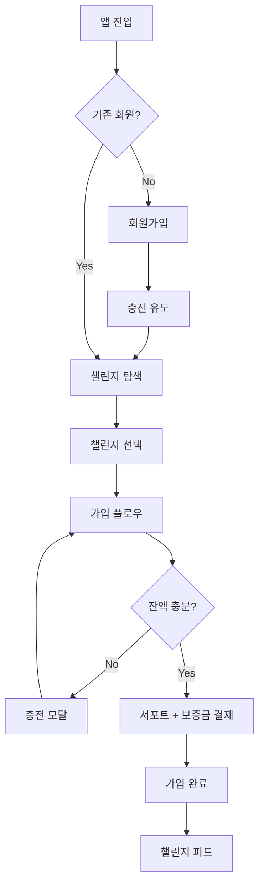
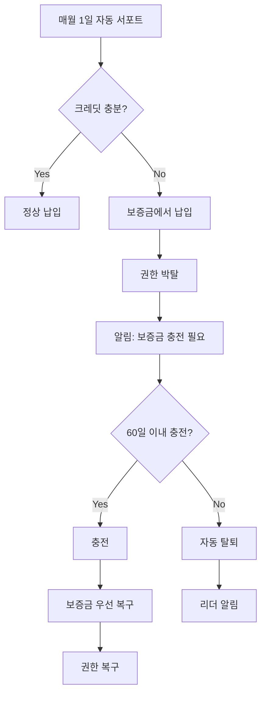
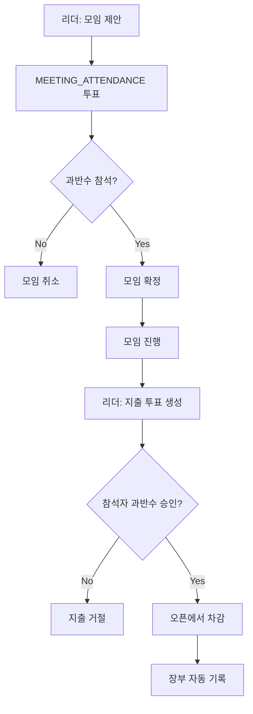

# WOORIDO 공통 UX 플로우 v1.0

> **Purpose:** 플랫폼 공통 사용자 여정 정의
> **Last Updated:** 2026-01-08

---

## 1. 핵심 사용자 여정 (User Journey)

```
┌─────────────────────────────────────────────────────────────────────┐
│                         WOORIDO 사용자 여정                          │
├─────────────────────────────────────────────────────────────────────┤
│                                                                     │
│  [발견]        [가입]        [활동]        [성장]        [완주]     │
│    │            │            │            │            │           │
│    ▼            ▼            ▼            ▼            ▼           │
│  검색/추천   회원가입      SNS 활동     정기 모임     1년 달성     │
│     │        충전         투표 참여     리더 활동     인증 마크     │
│     │        챌린지 가입   장부 확인                               │
│     │                                                              │
│     └──────────────────────────────────────────────────────────────│
│                                                                     │
└─────────────────────────────────────────────────────────────────────┘
```

---

## 2. 핵심 플로우

### 2.1 신규 가입 → 첫 챌린지 가입



### 2.2 보증금 충당 → 권한 복구



### 2.3 정기 모임 → 오픈 사용



---

## 3. 투표 플로우

### 3.1 투표 타입별 플로우

| 타입 | 생성자 | 대상 | 승인 조건 | 결과 |
|------|--------|------|----------|------|
| EXPENSE | 리더 | 전체 or 참석자 | 과반수~70% | 오픈 차감 |
| MEETING_ATTENDANCE | 리더 | 전체 | 과반수 | 모임 확정 |
| KICK | 리더/멤버 | 전체 | 70% | 강퇴 |
| RULE_CHANGE | 리더 | 전체 | 2/3 | 규칙 변경 |

### 3.2 투표 상태 전이

```
PENDING → APPROVED (승인)
        → REJECTED (거절)
        → EXPIRED (기한 만료)
```

---

## 4. 에러 복구 플로우

| 상황 | 사용자 액션 | 시스템 응답 |
|------|-----------|------------|
| 결제 실패 | 다시 시도 | 재결제 모달 |
| 네트워크 오류 | 새로고침 | 재시도 버튼 |
| 권한 없음 | - | Toast + 홈 이동 |
| 잔액 부족 | 충전하기 | 충전 모달 |

---

**관련 문서:**
- [ONBOARDING_MOBILE.md](../MOBILE/ONBOARDING_MOBILE.md)
- [ONBOARDING_DESKTOP.md](../DESKTOP/ONBOARDING_DESKTOP.md)
