# WOORIDO ERD - Mermaid Diagram (MVP Complete Version)

**작성일**: 2026-01-05
**버전**: v2.0 (MVP Complete)
**기반**: ERD_SPECIFICATION.md

---

## Mermaid ERD Code

```mermaid
erDiagram
    %% =========================================================
    %% 1. 사용자 및 인증 도메인 (USER & AUTH DOMAIN)
    %% =========================================================
    USERS {
        UUID id PK "기본 키"
        VARCHAR(100) email UK "고유 이메일 (중복 불가)"
        VARCHAR(255) password_hash "비 소셜 로그인용 해시"
        VARCHAR(50) name "사용자 실명"
        VARCHAR(500) profile_image_url "프로필 사진 URL"
        VARCHAR(20) phone "연락처"
        DATE birth_date "생년월일 (YYYY-MM-DD)"
        CHAR(1) gender "성별 (M/F/O)"
        VARCHAR(500) bio "자기소개"
        CHAR(1) is_verified "이메일 인증 여부 (Y/N)"
        VARCHAR(100) verification_token "이메일 인증 토큰"
        TIMESTAMP verification_token_expires "토큰 만료 시간"
        VARCHAR(20) social_provider "소셜 제공자 (복합 UK: GOOGLE/KAKAO)"
        VARCHAR(100) social_id "소셜 식별자 (복합 UK)"
        VARCHAR(100) password_reset_token "비밀번호 재설정 토큰"
        TIMESTAMP password_reset_expires "재설정 토큰 만료 시간"
        NUMBER failed_login_attempts "보안: 로그인 실패 횟수"
        TIMESTAMP locked_until "보안: 계정 잠금 만료 시간"
        TIMESTAMP created_at "가입일"
        TIMESTAMP updated_at "마지막 수정일"
        TIMESTAMP last_login_at "마지막 로그인"
    }

    SESSIONS {
        UUID id PK "세션 토큰"
        UUID user_id FK "참조: 사용자 ID"
        VARCHAR(500) return_url "인증/결제 후 복귀 URL"
        VARCHAR(20) session_type "세션 타입 (충전/가입/출금)"
        CHAR(1) is_used "사용 여부 (재사용 방지)"
        TIMESTAMP created_at "세션 생성일"
        TIMESTAMP expires_at "만료 시간 (30분)"
    }

    NOTIFICATIONS {
        UUID id PK "기본 키"
        UUID user_id FK "참조: 수신자 ID"
        VARCHAR(50) type "알림 타입 (초대/투표/장부 등)"
        VARCHAR(200) title "알림 제목"
        VARCHAR(500) content "알림 내용"
        VARCHAR(500) link_url "이동 링크"
        CHAR(1) is_read "읽음 여부 (Y/N)"
        TIMESTAMP read_at "읽은 시간"
        TIMESTAMP created_at "발송 시간"
    }

    %% =========================================================
    %% 2. 자금 관리 도메인 (높은 정합성 / 비관적 & 낙관적 락)
    %% =========================================================
    ACCOUNTS {
        UUID id PK "기본 키"
        UUID user_id FK "UK: 유저당 1계좌 (중복 불가)"
        BIGINT balance "가용 잔액 (0 이상)"
        BIGINT locked_balance "잠긴 잔액 (거래 대기중, 0 이상)"
        BIGINT version "낙관적 락 버전 (동시성 제어)"
        VARCHAR(10) bank_code "출금 은행 코드"
        VARCHAR(50) account_number "출금 계좌 번호"
        VARCHAR(50) account_holder "예금주 명"
        TIMESTAMP created_at "계좌 생성일"
        TIMESTAMP updated_at "마지막 거래일"
    }

    ACCOUNT_TRANSACTIONS {
        UUID id PK "기본 키"
        UUID account_id FK "참조: 계좌 ID"
        VARCHAR(20) type "거래 유형 (충전/출금/락/해제/이체)"
        BIGINT amount "거래 금액 (양수)"
        BIGINT balance_before "거래 전 잔액"
        BIGINT balance_after "거래 후 잔액"
        BIGINT locked_before "거래 전 잠금액"
        BIGINT locked_after "거래 후 잠금액"
        VARCHAR(100) idempotency_key UK "중복 처리 방지 키 (Idempotency)"
        UUID related_gye_id FK "관련 모임 ID (Nullable)"
        UUID related_user_id FK "관련 사용자 ID (Nullable)"
        VARCHAR(255) description "거래 적요/설명"
        VARCHAR(20) payment_method "결제 수단 (카드/계좌/카카오페이)"
        VARCHAR(100) payment_gateway_tx_id "PG사 거래 ID"
        TIMESTAMP created_at "거래 발생 시간"
    }

    %% =========================================================
    %% 3. 모임(계) 도메인 (핵심 비즈니스 / 소프트 삭제)
    %% =========================================================
    GYE {
        UUID id PK "기본 키"
        UUID creator_id FK "참조: 모임장 ID"
        VARCHAR(100) name "모임 이름"
        VARCHAR(2000) description "모임 설명"
        VARCHAR(50) category "카테고리 (여행/식도락 등)"
        NUMBER current_members "현재 인원 (반정규화)"
        NUMBER max_members "최대 인원"
        BIGINT balance "모임 잔액 (0 이상)"
        BIGINT monthly_fee "월 회비"
        BIGINT deposit_amount "가입 보증금"
        CHAR(1) is_public "공개 여부 (Y/N)"
        CHAR(1) join_approval_required "가입 승인 필요 여부"
        VARCHAR(500) thumbnail_url "썸네일 URL"
        VARCHAR(500) banner_url "배너 이미지 URL"
        BIGINT version "낙관적 락 버전"
        VARCHAR(20) status "상태 (모집중/활동중/완료)"
        TIMESTAMP deleted_at "삭제 시간 (Soft Delete)"
        VARCHAR(500) dissolution_reason "해산 사유"
        TIMESTAMP created_at "모임 생성일"
        TIMESTAMP updated_at "마지막 수정일"
    }

    GYE_MEMBERS {
        UUID id PK "기본 키"
        UUID gye_id FK "복합 UK: 모임 ID"
        UUID user_id FK "복합 UK: 회원 ID"
        VARCHAR(20) role "역할 (모임장/총무/회원)"
        CHAR(1) deposit_paid "보증금 납부 여부 (Y/N)"
        TIMESTAMP deposit_paid_at "보증금 납부일"
        TIMESTAMP deposit_locked_at "보증금 락 시작일"
        TIMESTAMP deposit_unlocked_at "보증금 락 해제일"
        TIMESTAMP last_fee_paid_at "마지막 회비 납부일"
        BIGINT total_fees_paid "누적 납부 회비"
        TIMESTAMP joined_at "가입일"
        TIMESTAMP left_at "탈퇴일 (NULL이면 활동중)"
    }

    LEDGER_ENTRIES {
        UUID id PK "기본 키"
        UUID gye_id FK "참조: 모임 ID"
        VARCHAR(20) type "유형 (수입/지출/회비/보증금)"
        BIGINT amount "금액 (양수)"
        VARCHAR(500) description "거래 내역"
        UUID created_by FK "작성자 (결재 상신자)"
        UUID approved_by FK "승인자 (모임장, Nullable)"
        TIMESTAMP approved_at "승인 일시"
        VARCHAR(500) receipt_url "영수증 이미지 URL"
        TIMESTAMP created_at "기록 생성일"
    }

    %% =========================================================
    %% 4. 투표 도메인 (합의 엔진)
    %% =========================================================
    VOTES {
        UUID id PK "기본 키"
        UUID gye_id FK "참조: 모임 ID"
        UUID created_by FK "참조: 발의자 ID"
        VARCHAR(20) type "투표 유형 (expense/kick/rule_change)"
        VARCHAR(200) title "투표 제목"
        VARCHAR(2000) description "투표 상세 설명"
        BIGINT amount "승인 시 지출 금액 (expense인 경우)"
        UUID target_user_id FK "강퇴 대상 (kick인 경우)"
        NUMBER required_approval_count "의결 필요 득표수"
        VARCHAR(20) status "상태 (대기/승인/거절/만료)"
        TIMESTAMP approved_at "결과 확정 일시"
        UUID ledger_entry_id FK "연동된 장부 ID (expense인 경우)"
        VARCHAR(20) ledger_status "장부 기록 상태 (대기/완료/실패)"
        TIMESTAMP expires_at "투표 마감 시간"
        TIMESTAMP created_at "투표 생성일"
        TIMESTAMP updated_at "마지막 투표 참여일"
    }

    VOTE_RECORDS {
        UUID id PK "기본 키"
        UUID vote_id FK "복합 UK: 투표 ID"
        UUID user_id FK "복합 UK: 참여자 ID"
        VARCHAR(20) choice "선택 (찬성/반대)"
        VARCHAR(500) comment "한줄 평/사유"
        TIMESTAMP created_at "투표 참여 시간"
    }

    %% =========================================================
    %% 5. 커뮤니티 도메인 (높은 조회수 / 반정규화)
    %% =========================================================
    POSTS {
        UUID id PK "기본 키"
        UUID gye_id FK "모임 ID (NULL이면 전체공개)"
        UUID created_by FK "참조: 작성자 ID"
        VARCHAR(4000) content "게시글 내용"
        NUMBER like_count "좋아요 수 (Atomic, 반정규화)"
        NUMBER comment_count "댓글 수 (Atomic, 반정규화)"
        TIMESTAMP created_at "게시일"
        TIMESTAMP updated_at "수정일"
    }

    POST_IMAGES {
        UUID id PK "기본 키"
        UUID post_id FK "참조: 게시글 ID"
        VARCHAR(500) image_url "이미지 주소"
        NUMBER display_order "표시 순서 (1, 2, 3...)"
        TIMESTAMP created_at "업로드 시간"
    }

    POST_LIKES {
        UUID id PK "기본 키"
        UUID post_id FK "복합 UK: 게시글 ID"
        UUID user_id FK "복합 UK: 좋아요 누른 유저"
        TIMESTAMP created_at "좋아요 시간"
    }

    COMMENTS {
        UUID id PK "기본 키"
        UUID post_id FK "참조: 게시글 ID"
        UUID created_by FK "참조: 작성자 ID"
        UUID parent_comment_id FK "부모 댓글 ID (대댓글용)"
        VARCHAR(1000) content "댓글 내용"
        TIMESTAMP created_at "작성일"
        TIMESTAMP updated_at "수정일"
    }

    %% =========================================================
    %% 관계 정의 (RELATIONSHIPS)
    %% =========================================================

    %% 사용자 도메인 관계
    USERS ||--o| ACCOUNTS : "1:1 소유"
    USERS ||--o{ SESSIONS : "다중 세션 보유"
    USERS ||--o{ NOTIFICATIONS : "다중 알림 수신"

    %% 모임 도메인 관계
    USERS ||--o{ GYE : "생성/운영"
    USERS ||--o{ GYE_MEMBERS : "참여"
    GYE ||--o{ GYE_MEMBERS : "회원 보유"
    GYE ||--o{ LEDGER_ENTRIES : "재무 기록 보유"
    GYE ||--o{ VOTES : "투표/안건 보유"
    GYE ||--o{ POSTS : "게시글 보유 (옵션)"

    %% 자금 도메인 관계
    ACCOUNTS ||--o{ ACCOUNT_TRANSACTIONS : "거래 내역 보유"
    GYE ||--o{ ACCOUNT_TRANSACTIONS : "모임 관련 거래"

    %% 투표 도메인 관계
    USERS ||--o{ LEDGER_ENTRIES : "생성/승인"
    USERS ||--o{ VOTES : "발의"
    USERS ||--o{ VOTE_RECORDS : "투표 행사"
    VOTES ||--o| LEDGER_ENTRIES : "트리거 (승인 시 1:1)"
    VOTES ||--o{ VOTE_RECORDS : "투표 집계"

    %% 커뮤니티 도메인 관계
    USERS ||--o{ POSTS : "작성"
    USERS ||--o{ COMMENTS : "댓글 작성"
    USERS ||--o{ POST_LIKES : "좋아요"
    POSTS ||--o{ POST_IMAGES : "이미지 포함"
    POSTS ||--o{ POST_LIKES : "좋아요 보유"
    POSTS ||--o{ COMMENTS : "댓글 보유"
    COMMENTS ||--o{ COMMENTS : "대댓글 (재귀)"
```



---

## 주요 변경사항 (v1 → v2)

### 추가된 핵심 필드

#### GYE 테이블
```diff
+ category VARCHAR(50) "음식/여행/스터디 등 - 필수!"
+ monthly_fee BIGINT "월 회비"
+ deposit_amount BIGINT "보증금 금액"
+ is_public CHAR(1) "공개/비공개"
+ join_approval_required CHAR(1) "자동 가입/승인 필요"
+ thumbnail_url VARCHAR(500)
+ banner_url VARCHAR(500)
+ dissolution_reason VARCHAR(500) "해산 이유"
```

#### GYE_MEMBERS 테이블
```diff
+ deposit_paid_at TIMESTAMP "보증금 납부 시간"
+ deposit_locked_at TIMESTAMP "보증금 락 시작"
+ deposit_unlocked_at TIMESTAMP "보증금 해제"
+ last_fee_paid_at TIMESTAMP "마지막 회비 납부"
+ total_fees_paid BIGINT "누적 회비"
+ left_at TIMESTAMP "탈퇴 시간"
```

#### VOTES 테이블
```diff
+ amount BIGINT "투표 지출 금액"
+ required_approval_count NUMBER "필요 찬성 수"
+ approved_at TIMESTAMP "승인 시간"
```

#### ACCOUNT_TRANSACTIONS 테이블
```diff
+ balance_before BIGINT "트랜잭션 전 잔액"
+ balance_after BIGINT "트랜잭션 후 잔액"
+ locked_before BIGINT "트랜잭션 전 락 잔액"
+ locked_after BIGINT "트랜잭션 후 락 잔액"
+ related_gye_id UUID "모임 관련 거래"
+ related_user_id UUID "사용자간 거래"
+ payment_method VARCHAR(20) "결제 수단"
+ payment_gateway_tx_id VARCHAR(100) "PG사 거래 ID"
```

#### ACCOUNTS 테이블
```diff
+ bank_code VARCHAR(10) "은행 코드"
+ account_number VARCHAR(50) "계좌번호"
+ account_holder VARCHAR(50) "예금주"
```

#### USERS 테이블
```diff
+ password_hash VARCHAR(255) "일반 로그인용"
+ profile_image_url VARCHAR(500)
+ phone VARCHAR(20)
+ birth_date DATE
+ gender CHAR(1)
+ bio VARCHAR(500)
+ is_verified CHAR(1) "이메일 인증 여부"
+ verification_token VARCHAR(100)
+ verification_token_expires TIMESTAMP
+ password_reset_token VARCHAR(100)
+ password_reset_expires TIMESTAMP
+ failed_login_attempts NUMBER
+ locked_until TIMESTAMP
+ last_login_at TIMESTAMP
```

---

## 제약조건 요약

### CHECK Constraints
```sql
-- ACCOUNTS
CHECK (balance >= 0)
CHECK (locked_balance >= 0)
CHECK (balance + locked_balance >= 0)

-- GYE
CHECK (current_members <= max_members)
CHECK (balance >= 0)
CHECK (monthly_fee >= 0)
CHECK (deposit_amount >= 0)

-- ACCOUNT_TRANSACTIONS
CHECK (amount > 0)

-- LEDGER_ENTRIES
CHECK (amount > 0)

-- VOTES
CHECK (amount IS NULL OR amount > 0)
CHECK (required_approval_count > 0)

-- POSTS
CHECK (like_count >= 0)
CHECK (comment_count >= 0)
```

### UNIQUE Constraints
```sql
-- USERS
UK: email
UK: (social_provider, social_id)

-- ACCOUNTS
UK: user_id

-- ACCOUNT_TRANSACTIONS
UK: idempotency_key

-- GYE_MEMBERS
UK: (gye_id, user_id)

-- VOTE_RECORDS
UK: (vote_id, user_id)

-- POST_LIKES
UK: (post_id, user_id)

-- POST_IMAGES
UK: (post_id, display_order)
```

### CASCADE Policies
```sql
-- ON DELETE CASCADE (자동 삭제)
GYE_MEMBERS.gye_id → GYE
LEDGER_ENTRIES.gye_id → GYE
VOTES.gye_id → GYE
ACCOUNT_TRANSACTIONS.account_id → ACCOUNTS
POST_IMAGES.post_id → POSTS
POST_LIKES.post_id → POSTS
COMMENTS.post_id → POSTS

-- ON DELETE RESTRICT (삭제 금지)
GYE.creator_id → USERS
GYE_MEMBERS.user_id → USERS

-- ON DELETE SET NULL (NULL로 설정)
POSTS.created_by → USERS
COMMENTS.created_by → USERS
LEDGER_ENTRIES.created_by → USERS
```

---

## 비즈니스 로직 매핑

### Trust Triangle (3대 차별화 요소)

#### 1️⃣ 선충전 락 (Pre-Deposit Lock)
**사용 테이블**: `ACCOUNTS`, `ACCOUNT_TRANSACTIONS`, `GYE_MEMBERS`

```sql
-- 모임 가입 시 보증금 락
-- 1. ACCOUNTS.balance -= deposit_amount
-- 2. ACCOUNTS.locked_balance += deposit_amount
-- 3. GYE_MEMBERS.deposit_paid = 'Y'
-- 4. GYE_MEMBERS.deposit_locked_at = NOW()
-- 5. ACCOUNT_TRANSACTIONS 기록 (type='LOCK')
```

**사용 필드**: `GYE.deposit_amount`, `ACCOUNTS.locked_balance`

#### 2️⃣ 결제 감시 다각화 (Multi-Approval Vote)
**사용 테이블**: `VOTES`, `VOTE_RECORDS`, `LEDGER_ENTRIES`

```sql
-- 투표 승인 시 장부 기록 연동
-- 1. VOTES.status = 'APPROVED'
-- 2. LEDGER_ENTRIES 생성 (amount = VOTES.amount)
-- 3. VOTES.ledger_entry_id = LEDGER_ENTRIES.id
-- 4. VOTES.ledger_status = 'RECORDED'
-- 5. GYE.balance -= VOTES.amount
```

**사용 필드**: `VOTES.amount`, `VOTES.required_approval_count`

#### 3️⃣ 장부 투명화 (Transparent Ledger)
**사용 테이블**: `LEDGER_ENTRIES`

```sql
-- 모든 재무 활동 기록
-- - 회비 징수: type='FEE_COLLECTION'
-- - 지출: type='EXPENSE' (VOTES 연동)
-- - 보증금 락/해제: type='DEPOSIT_LOCK'/'DEPOSIT_UNLOCK'
```

---

## MVP 정의

이 ERD는 **MVP Complete** 버전입니다.

### MVP에 포함된 기능
- ✅ 소셜 로그인 (카카오/구글)
- ✅ 충전/출금
- ✅ 모임 생성/가입/탈퇴
- ✅ 보증금 락/해제
- ✅ 회비 징수
- ✅ 투표 시스템
- ✅ 장부 기록
- ✅ 피드/게시글/댓글
- ✅ 좋아요
- ✅ 알림

### MVP에서 제외된 기능
- ❌ 1:1 채팅
- ❌ 파일 첨부 (영수증 외)
- ❌ 실시간 알림 (WebSocket)
- ❌ 추천 알고리즘 (Django 연동은 Phase 6-7)

---

**문서 버전**: v2.0 (MVP Complete)
**최종 수정**: 2026-01-05
**작성자**: Claude (Sonnet 4.5)
